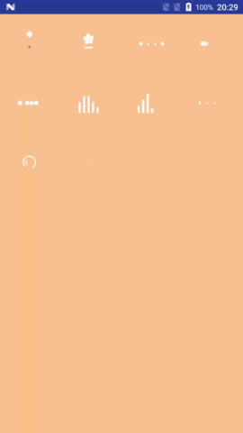

# LoadingAnimations

## Demo



## Usage

### Step 1

Add dependencies in build.gradle.

```gradle
    compile 'com.example.mzy.indicators:LoadingAnimations:1.0.3'
```


### Step 2

Add the LoadingAnimations to your layout:

e.g. 

```xml
    <com.example.mzy.indicators.LoadingIndicator
        android:layout_width="wrap_content"
        android:layout_height="wrap_content"
        app:indicatorName="ParallelogramIndicator" />
```

```attribute

indicatorColor:  indicator color, default is white.
indicatorSpeed:  animation duration, must be a number greater than zero.
indicatorName:   indicator name, refer to the **Indicators** below.

```

## Indicators

As seen above in the **Demo**, the indicators are as follows:

**Row 1**
 * `BasketBallIndicator`
 * `StarIndicator`
 * `CircleScaleIndicator`
 * `CircleWaveIndicator`

**Row 2**
 * `CircleJumpIndicator`
 * `CircleCollisionIndicator`
 * `DropIndicator`
 * `TrackIndicator`

**Row 3**
 * `CircleRotateScaleIndicator`
 * `CircleTriangleIndicator`
 * `ChartRectIndicator1`
 * `ChartRectIndicator2`

**Row4**
 * `ParallelogramIndicator`
 * `RectJumpMoveIndicator`
 * `ArcRotateIndicator`
 * `ArcRotateScaleIndicator`

 **Row5**
  * `CircleRotateIndicator`

